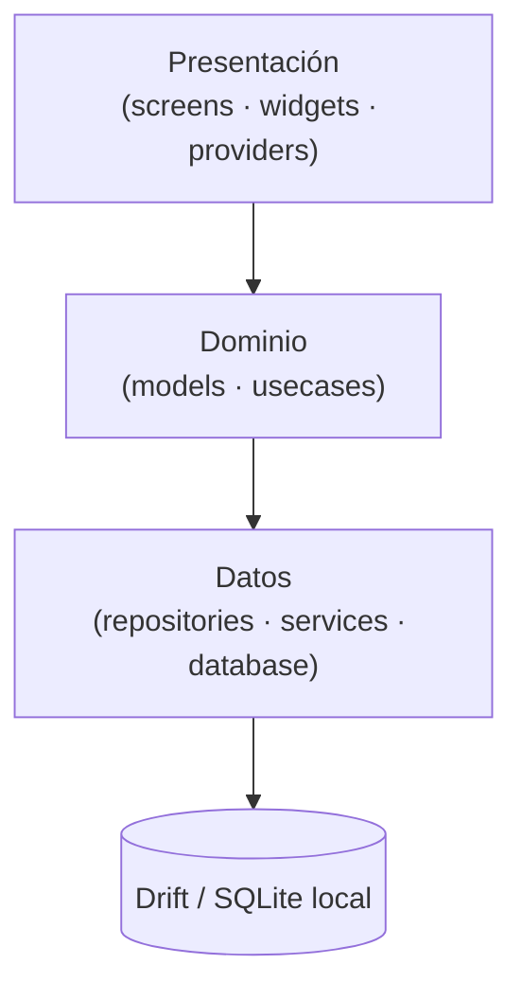

# Marilin Mobile

> Sistema **offline-first** de gestión de logística, distribución y venta directa para el reparto de agua y soda.

Marilin App digitaliza la operación diaria del repartidor: planificación de la ruta, gestión de clientes y cuentas corrientes, registro de ventas, control de envases retornables, cobros multipago y sincronización de datos. Está diseñada para **seguir funcionando sin conexión a Internet**, ya que gran parte del reparto ocurre en zonas con señal intermitente.

---

## Tabla de contenidos

- [Características](#características)
- [Stack tecnológico](#stack-tecnológico)
- [Arquitectura](#arquitectura)
- [Estructura del proyecto](#estructura-del-proyecto)
- [Modelo de datos](#modelo-de-datos)
- [Requisitos previos](#requisitos-previos)
- [Instalación y ejecución](#instalación-y-ejecución)
- [Generación de código (codegen)](#generación-de-código-codegen)
- [Convenciones](#convenciones)
- [Roadmap](#roadmap)
- [Equipo](#equipo)
- [Licencia](#licencia)

---

## Características

- **Ruta del día**: recorrido planificado con sus paradas, progreso de la jornada y accesos rápidos por cliente.
- **Clientes**: listado ordenado por recorrido, ficha con historial, cuenta corriente y envases retornables en poder del cliente.
- **Ventas**: registro rápido de productos (bidones, sifones) con flujo de pedido y cobro en dos pasos.
- **Cobros multipago**: efectivo, transferencias y actualización de cuenta corriente.
- **Inventario**: control del stock cargado en el vehículo y movimientos de envases.
- **Visitas**: registro de visitas sin venta con su motivo (cliente ausente, cerrado, sin compra).
- **Geolocalización y mapas**: ubicación de clientes, geocodificación y trazado de rutas sobre el mapa.
- **Contacto directo**: apertura de WhatsApp y llamadas desde la ficha del cliente.
- **Sincronización offline-first**: persistencia local con registro de auditoría (_audit log_) para reconciliar datos al recuperar conexión.

---

## Stack tecnológico

| Área               | Tecnología                                                                      |
| ------------------ | ------------------------------------------------------------------------------- |
| Framework          | [Flutter](https://flutter.dev) 3.41 (stable) · Dart 3.11+                       |
| Estado             | [Riverpod v3](https://riverpod.dev) (`flutter_riverpod`, `riverpod_annotation`) |
| Persistencia local | [Drift](https://drift.simonbinder.eu) (SQLite reactivo) · `drift_flutter`       |
| Modelos inmutables | [Freezed](https://pub.dev/packages/freezed)                                     |
| Mapas y ubicación  | `flutter_map`, `latlong2`, `geolocator`                                         |
| Red                | `http` (geocodificación / routing)                                              |
| UI                 | Material 3 · `font_awesome_flutter`                                             |
| Utilidades         | `url_launcher`, `uuid`, `path_provider`                                         |
| Codegen            | `build_runner`, `drift_dev`, `freezed`                                          |

---

## Arquitectura

El proyecto sigue un enfoque **Feature-First** combinado con **Clean Architecture**. Cada funcionalidad es un módulo autónomo, dividido en tres capas con dependencias unidireccionales:



- **Presentación**: pantallas y widgets desacoplados. Los _smart widgets_ consumen `Provider`s de Riverpod y gestionan el estado de la vista; los _presentational widgets_ son UI pura y reutilizable.
- **Dominio**: modelos inmutables (Freezed) y casos de uso. Lógica de negocio aislada de frameworks y de la base de datos.
- **Datos**: `Repositories` que abstraen el origen de datos, `services` (geocoding, routing) y las tablas de Drift. La reactividad por _streams_ de Drift mantiene la interfaz sincronizada ante cualquier cambio en la base local.

La aplicación arranca con un _shell_ raíz (`NavigationBar` de Material 3) e `IndexedStack` que conserva el estado de cuatro pestañas: **Ruta**, **Clientes**, **Venta** e **Historial**.

---

## Estructura del proyecto

```
lib/
├── main.dart                  # Punto de entrada · ProviderScope · shell de navegación
├── core/                      # Código transversal a todas las features
│   ├── services/              # DriftDatabase, mixins y seed de datos
│   ├── theme/                 # Tema Material 3 y design tokens
│   ├── utils/                 # Formateadores, avatares, Resource<T>
│   └── widgets/               # Widgets compartidos (search bar, chips, toasts…)
└── features/                  # Un módulo por funcionalidad
    ├── customers/             # Clientes, direcciones y preferencias
    │   ├── data/              #   repositories · services · database
    │   ├── domain/            #   models · usecases
    │   └── presentation/      #   screens · widgets · providers
    ├── route/                 # Ruta del día y paradas
    ├── sales/                 # Ventas
    ├── payments/              # Cobros y cuenta corriente
    ├── inventory/             # Inventario y envases
    ├── products/              # Catálogo de productos
    ├── visits/                # Visitas sin venta
    ├── history/               # Historial
    └── sync/                  # Sincronización y audit log
```

---

## Modelo de datos

La base de datos local se define con Drift (`lib/core/services/database.helper.dart`) y agrupa las tablas por feature:

| Dominio          | Tablas                                                             |
| ---------------- | ------------------------------------------------------------------ |
| Clientes         | `CustomerTable`, `CustomerAddressTable`, `CustomerPreferenceTable` |
| Cuenta corriente | `CustomerAccountEntryTable`, `CustomerBalanceTable`                |
| Ruta             | `RouteTable`, `RouteStopTable`, `RouteInventoryTable`              |
| Productos        | `ProductTable`                                                     |
| Ventas           | `SaleTable`, `SaleItemTable`                                       |
| Pagos            | `PaymentTable`                                                     |
| Inventario       | `ContainerMovementTable`                                           |
| Visitas          | `VisitTable`                                                       |
| Sincronización   | `AuditLogTable`                                                    |

---

## Requisitos previos

- [Flutter SDK](https://docs.flutter.dev/get-started/install) **3.41** o superior (canal `stable`).
- Dart **3.11+** (incluido con Flutter).
- Un dispositivo o emulador **Android** / **iOS**.
- Para funciones de mapa y ubicación: permisos de localización habilitados en el dispositivo.

Verificá tu entorno con:

```bash
flutter doctor
```

---

## Instalación y ejecución

```bash
# 1. Clonar el repositorio
git clone https://github.com/Fr4nkit0/app.git marilin
cd marilin

# 2. Instalar dependencias
flutter pub get

# 3. Generar el código (Drift, Freezed)
dart run build_runner build --delete-conflicting-outputs

# 4. Ejecutar la aplicación
flutter run
```

---

## Generación de código (codegen)

El proyecto usa generación de código para la base de datos (Drift) y los modelos inmutables (Freezed). Tras modificar una tabla o un modelo, regenerá los archivos `*.g.dart` / `*.freezed.dart`:

```bash
# Generación única
dart run build_runner build --delete-conflicting-outputs

# Regeneración automática en cada cambio (desarrollo)
dart run build_runner watch --delete-conflicting-outputs
```

---

## Convenciones

- **Nomenclatura de archivos**: separación por puntos según su rol, p. ej. `customer.table.dart`, `drift.customer.repository.dart`, `create.customer.usecase.dart`.
- **Capas por feature**: nunca importar desde `presentation` hacia `data` salteándose el dominio; las dependencias apuntan hacia adentro (Presentación → Dominio → Datos).
- **Estado**: la UI no contiene lógica de negocio; se apoya en providers de Riverpod y en los _streams_ reactivos de Drift.
- **Commits**: se siguen [Conventional Commits](https://www.conventionalcommits.org/) (`feat`, `fix`, `refactor`…).

---

## Equipo

- **Franco Calisaya**
- **Facundo Ramirez**
- **Christian Tolaba**
